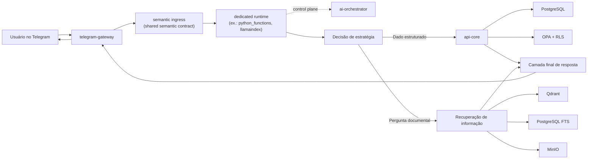

# EduAssist Platform

Plataforma de atendimento escolar com IA conversacional, integrada ao Telegram, desenvolvida sobre infraestrutura real e dados integralmente simulados. O projeto foi construído para um cenário escolar sensível: responder perguntas institucionais, consultar dados protegidos, negar acessos indevidos com segurança e manter trilha técnica suficiente para auditoria, avaliação e evolução contínua.

O repositório compara quatro caminhos de orquestração sobre a mesma base compartilhada de domínio, segurança, armazenamento, recuperação de informação e observabilidade:

- `langgraph`
- `python_functions`
- `llamaindex`
- `specialist_supervisor`

Todos os quatro caminhos compartilham um contrato semântico de entrada para atos conversacionais de baixo risco e alta precedência, como:

- saudação;
- identidade do assistente;
- capabilities;
- guidance de vinculação/autenticação;
- preferência de idioma;
- clarificação de entrada opaca;
- limite de escopo.

Isso mantém coerência de produto sem apagar a diferenciação arquitetural entre as stacks. A regra de alto nível hoje é:

1. LLM de entrada: classifica o ato da mensagem;
2. stack: resolve com ferramentas, retrieval, memória e planejamento próprios;
3. LLM de saída: lapida a superfície final com contrato validado, sem reabrir um fallback indevido nem alterar a decisão de policy.

## Fonte única de verdade

Este repositório é a fonte única de verdade do EduAssist Platform.

Na prática:

- trabalho ativo de produto, runtime, testes e documentação deve acontecer aqui;
- worktrees temporários não devem sobreviver ao merge ou abandono da branch;
- protótipos antigos e estudos locais não devem competir com este repositório como se fossem outra versão oficial do sistema.

## Estado recente de hardening

Alguns débitos arquiteturais importantes já foram fechados no baseline atual:

- o antigo `runtime_core.py` deixou de concentrar um bloco monolítico de constantes e expressões; a superfície pesada foi extraída para `runtime_core_constants.py`;
- o retrieval híbrido agora combina fusão lexical+densa com `late interaction` e `cross-encoder rerank`, em vez de depender apenas do score híbrido inicial;
- a identidade interna entre serviços ficou `SPIFFE-ready`, sem quebrar o modo local baseado em token;
- o repositório passou a proteger módulos críticos com testes de `hotspot budget`, para evitar que wrappers e runtimes extraídos cresçam silenciosamente de novo.

## Comece por aqui

Se você está chegando agora ao repositório, a ordem mais útil é:

1. este `README.md`, para visão geral e bootstrap;
2. [Estado de referência dedicated-first](docs/architecture/dedicated-first-reference-state.md), para a verdade operacional atual;
3. [Operação local](docs/operations/local-development.md), para subir e testar a stack;
4. [Tests](tests/README.md), para entender as superfícies de validação;
5. [Documentação](docs/README.md), para navegar pelos documentos formais.

## O que o projeto faz

- atende perguntas públicas sobre calendário, matrícula, bolsas, secretaria e rotinas escolares;
- responde consultas protegidas sobre notas, frequência, financeiro e situação administrativa;
- protege dados sensíveis com autenticação, autorização contextual e negação segura;
- compara quatro arquiteturas agênticas sob a mesma superfície experimental;
- registra evidências, métricas e rastros técnicos para depuração e auditoria.

## Como a resposta é produzida

O fluxo principal é simples de entender:

1. o usuário envia a pergunta pelo Telegram;
2. o `telegram-gateway` recebe e normaliza a mensagem;
3. uma camada compartilhada de `semantic ingress` pode classificar atos curtos ou ambíguos antes do roteamento profundo;
4. o runtime dedicado da stack alvo executa o serving principal;
5. o `ai-orchestrator` central atua como `control plane/router` e superfície interna compartilhada, não como entrypoint principal de serving;
6. perguntas estruturadas seguem para serviços internos confiáveis no `api-core`;
7. perguntas documentais passam pela camada de recuperação de informação;
8. se faltar contexto, o sistema pede esclarecimento ou retorna limite de escopo com segurança, em vez de inventar um fallback administrativo;
9. a camada final organiza a resposta em linguagem natural, sem perder o vínculo com a evidência;
10. o Telegram recebe a resposta final.

No `specialist_supervisor`, toda resposta elegível, inclusive as vindas de caminhos determinísticos, agora passa por um `answer surface refiner` validado. O refiner tenta primeiro uma verbalização estruturada; se o modelo local não obedecer bem ao schema, o sistema usa um fallback controlado em texto livre e só aceita a nova superfície quando ela preserva fatos, nomes, valores, datas, escopo e intenção da resposta original. Respostas de bloqueio sensível, negação de terceiro e guardrails de privacidade continuam protegidas contra reescrita insegura.

Nas stacks `langgraph`, `python_functions` e `llamaindex`, o mesmo padrão já está ativo no pós-processamento compartilhado: a resposta final passa por uma etapa leve de `answer surface refiner`, mas o texto original é preservado automaticamente quando a LLM não consegue melhorar a superfície sem violar grounding ou recorte da pergunta.



## Componentes principais

### Aplicações

- `api-core`: regras de negócio, identidade, autorização contextual, serviços estruturados e trilha de auditoria.
- `ai-orchestrator`: control plane e router interno entre os runtimes dedicados, além de endpoints compartilhados. Não é o caminho recomendado de serving direto para `/v1/messages/respond`.
- `ai-orchestrator-specialist`: caminho premium, orientado à qualidade, usado no comparativo dos quatro caminhos.
- `telegram-gateway`: webhook, idempotência, retentativa e entrega da resposta final no Telegram.
- `admin-web`: interface operacional com autenticação via Keycloak.
- `worker`: sincronização documental, sementes de dados e tarefas de apoio.

### Infraestrutura

- `PostgreSQL`: fonte principal da verdade para dados estruturados.
- `Qdrant`: índice vetorial para busca semântica.
- `MinIO`: armazenamento de objetos e documentos.
- `Redis`: apoio operacional e estado efêmero.
- `Keycloak`: autenticação e identidade.
- `OPA`: políticas contextuais de acesso.
- `OpenTelemetry`, `Tempo`, `Loki`, `Prometheus` e `Grafana`: observabilidade distribuída.

No baseline atual, a observabilidade já roda com `tail sampling` no `otel-collector`, reduzindo ruído de tracing sem desativar visibilidade de erro e latência.

## Os quatro caminhos ativos

### `langgraph`

Mais forte em governança, clareza de fluxo e auditabilidade. É o caminho mais fácil de inspecionar quando o foco está em explicar por que o sistema respondeu de determinada forma.

### `python_functions`

É o caminho mais enxuto e mais previsível. Usa rotas determinísticas de forma explícita e terminou como o melhor resultado agregado e a menor latência média na rodada final de referência.

### `llamaindex`

É o caminho mais orientado à recuperação documental. Ganha força quando a pergunta exige leitura, combinação e síntese do acervo institucional.

### `specialist_supervisor`

É o caminho premium. Prioriza qualidade em casos mais exigentes, sobretudo no recorte protegido, mas com maior custo operacional.

## Recuperação de informação

No projeto, recuperação de informação significa buscar evidência antes de responder. Isso evita depender apenas da memória paramétrica do modelo.

O desenho atual combina:

- busca textual com `PostgreSQL Full Text Search`;
- busca semântica com `Qdrant`;
- fusão híbrida dos resultados;
- rerank semântico em duas etapas;
- filtragem por visibilidade e agrupamento por documento;
- resumo documental e recuperação recursiva em caminhos específicos;
- `GraphRAG` seletivo, usado apenas quando faz sentido.

O baseline forte do RAG hoje combina:

- `late interaction` com `answerdotai/answerai-colbert-small-v1`;
- `cross-encoder` multilíngue com `jinaai/jina-reranker-v2-base-multilingual`;
- fusão ponderada com o score híbrido original antes da composição grounded.

Perguntas sobre notas, frequência, financeiro e protocolos estruturados não dependem prioritariamente dessa camada. Nesses casos, o sistema prefere serviços determinísticos no `api-core`.

## Identidade interna entre serviços

O baseline local continua aceitando `X-Internal-Api-Token` para chamadas `service-to-service`, mas os serviços principais também ficaram `SPIFFE-ready`.

Na prática:

- `api-core`, `ai-orchestrator`, runtimes dedicados, `specialist_supervisor` e `telegram-gateway` aceitam um `SPIFFE ID` encaminhado por proxy confiável;
- esse identificador só é aceito quando aparece em allowlist explícita;
- quando aceito, ele é convertido localmente para o mesmo enforcement interno já usado pelos endpoints;
- o Compose local continua em modo `token` por padrão;
- um rollout completo de `SPIFFE/SPIRE` continua sendo decisão de ambiente, não pré-requisito para desenvolvimento local.

## Semantic ingress e fallback seguro

O projeto não depende apenas de listas lexicais para entender entradas curtas ou pouco claras. A arquitetura atual usa uma camada compartilhada de `semantic ingress` para classificar atos de entrada que exigem precedência forte, como:

- `greeting`
- `assistant_identity`
- `capabilities`
- `auth_guidance`
- `input_clarification`
- `language_preference`
- `scope_boundary`

Essa camada não responde livremente ao usuário. Ela só classifica o ato. Depois:

- a stack resolve o caso com sua própria arquitetura;
- a camada final pode lapidar a resposta;
- e, se a entrada continuar incerta ou fora de escopo, o sistema prefere clarificar ou declarar limite de escopo com segurança.

Na prática, isso evita que uma mensagem pouco clara de usuário autenticado caia por engano em `situação administrativa do cadastro`.

## Arquitetura de dados

O armazenamento segue a natureza do dado:

- `PostgreSQL` guarda usuários, vínculos, alunos, turmas, matrículas, notas, frequência, contratos, faturas, pagamentos, calendário, conversas e auditoria.
- `MinIO` guarda regulamentos, manuais, comunicados e demais documentos institucionais.
- `Qdrant` indexa representações vetoriais do corpus documental.
- `Redis` apoia cache, coordenação operacional e estado efêmero.

Essa separação permite responder cada tipo de pergunta a partir da fonte mais confiável.

## Início rápido

### Pré-requisitos

- Docker e Docker Compose
- Python 3.12 com `uv`
- Node.js para o `admin-web`
- opcionalmente:
  - `GOOGLE_API_KEY` ou `OPENAI_API_KEY`
  - `TELEGRAM_BOT_TOKEN`
  - `TELEGRAM_WEBHOOK_SECRET`

### Bootstrap básico

```bash
make bootstrap
make compose-up
make db-upgrade
make db-seed-foundation
make db-seed-school-expansion
make db-seed-deep-population
make db-seed-benchmark-scenarios
make keycloak-sync-runtime-users
make db-seed-auth-bindings
make documents-sync
```

### Telegram ponta a ponta

Para o Telegram funcionar de verdade, `postgres`, `api-core`, o runtime dedicado alvo, e `telegram-gateway` precisam estar online e saudáveis, e o webhook precisa apontar para uma URL pública válida.

```bash
make telegram-public-up
make telegram-webhook-info
```

Para um fluxo dedicado-first mais direto, use um dos atalhos abaixo:

```bash
make compose-up-telegram-python-functions
make compose-up-telegram-llamaindex
make compose-up-telegram-langgraph
make compose-up-telegram-specialist
```

### Alternando o modelo por feature flag

O baseline local recomendado continua sendo `Gemma 4 E4B`, e agora existe um segundo profile experimental para `Qwen3-4B-Instruct-2507` local.

```bash
make compose-up-dedicated-core-gemma4e4b-local
make compose-up-dedicated-core-qwen3-4b-local
make compose-up-dedicated-core-gemini-flash-lite
```

### Modo seguro para benchmark local

Quando a meta for comparar stacks e modelos no notebook local, o fluxo seguro não é subir tudo e medir ao mesmo tempo. O procedimento recomendado é:

1. um modelo por vez;
2. uma stack por vez;
3. `telegram-gateway` e `cloudflared` desligados durante a bateria pesada;
4. artefatos temporários em `/dev/shm` ou outro diretório temporário;
5. copiar os relatórios finais para `docs/architecture/` só no fim.

Isso reduz a chance de saturar o SSD/NVMe em `100%` por escrita contínua e também evita começar a rodada antes de a troca de modelo realmente ter sido aplicada.

O passo a passo detalhado ficou documentado em [docs/operations/local-development.md](docs/operations/local-development.md), na seção de bring-up seguro e benchmark local.

Os profiles locais usam um endpoint `OpenAI-compatible` servido por `llama.cpp`:

- `gemma4e4b_local`: `Gemma 4 E4B` em `Q4_K_M`
- `qwen3_4b_instruct_local`: `Qwen3-4B-Instruct-2507` em `Q5_K_M`

O `Qwen` entra como feature flag explícita para benchmark A/B; o default operacional do repositório não muda.

Na rodada final do A/B local em `2026-04-17`, o `Gemma` endurecido com o `answer surface refiner` e os ajustes arquiteturais do `specialist` fechou em `15/15`, `keyword_pass 15/15` e `quality 100.0`, enquanto o `Qwen` permaneceu melhor em latência, porém abaixo em qualidade semântica agregada. A decisão atual do repositório segue sendo: `Gemma` como baseline, `Qwen` como profile experimental.

Esses comandos:

- sobem a base operacional dedicada;
- apontam o `telegram-gateway` para o runtime escolhido;
- reciclam o `cloudflared`;
- registram o webhook automaticamente.

Para um caminho mais estável que `TryCloudflare`, configure no `.env`:

- `CLOUDFLARED_TUNNEL_TOKEN`
- `TELEGRAM_PUBLIC_BASE_URL`

E então suba o fluxo estável:

```bash
make telegram-public-up-stable
make telegram-webhook-health
make telegram-webhook-info
```

### Observabilidade

```bash
make observability-up
make observability-logs
```

Serviços principais:

- Grafana: `http://localhost:3004`
- Prometheus: `http://localhost:9090`
- Tempo: `http://localhost:3200`
- Loki: `http://localhost:3100`

## Testes e avaliação

### Smokes

```bash
make compose-up-dedicated-core
make smoke-dedicated
make smoke-dedicated-multiturn
make smoke-dedicated-long-memory
make smoke-dedicated-semantic-ingress
make smoke-telegram-dedicated
make runtime-parity-check
make smoke-local
make smoke-authz
make smoke-adversarial
make smoke-all
```

Observação:

- `make smoke-dedicated` é o smoke recomendado para a arquitetura atual.
- `make smoke-dedicated-multiturn` é a bateria recomendada para validar continuidade conversacional nos runtimes dedicados.
- `make smoke-dedicated-long-memory` valida retorno a contexto anterior, correção tardia e retomada de workflow.
- `make smoke-dedicated-semantic-ingress` valida a superfície semântica compartilhada de entrada, incluindo greetings multilíngues, `input_clarification`, `language_preference`, `auth_guidance` e `scope_boundary`.
- `make smoke-telegram-dedicated` valida o caminho real `telegram-gateway -> runtime dedicado -> api-core`, com verificação da persistência interna no `api-core`.
- `make runtime-parity-check` valida que gateway, control plane e runtimes dedicados estão sem drift operacional entre `source mode` e Docker.
- `make smoke-local` e `make eval-orchestrator` existem por compatibilidade com o control plane e exigem subir o `ai-orchestrator` central com `CONTROL_PLANE_ALLOW_DIRECT_SERVING=true`, por exemplo via `make compose-up-control-plane-compat`.

### Evals

```bash
make eval-dedicated
make eval-control-plane-compat
```

Observação:

- `make eval-dedicated` é o alvo padrão e avalia um runtime dedicado diretamente.
- `make eval-control-plane-compat` preserva o caminho histórico do control plane apenas para compatibilidade e comparação.

### Readiness

```bash
make release-readiness
```

### Estado de referência atual

A verdade pública do repositório deixou de ser a tabela antiga do control plane e passou a ser o pacote de validação `dedicated-first`. Em vez de um único benchmark estático, o projeto hoje usa um conjunto de gates complementares:

- `make smoke-dedicated`
- `make smoke-dedicated-multiturn`
- `make smoke-dedicated-long-memory`
- `make smoke-telegram-dedicated`
- `make runtime-parity-check`
- `make promotion-gate-check`

Os artefatos mais úteis dessa camada de verdade ficam em:

- [Dedicated-First Reference State](docs/architecture/dedicated-first-reference-state.md)

### Política operacional do control plane

Na arquitetura atual, `ai-orchestrator` não é mais o caminho recomendado de serving final. O papel dele passou a ser:

- `control plane/router`
- superfície interna de administração, comparação e APIs internas
- apoio a runtimes dedicados quando houver dependências transversais explícitas

O serving principal de usuário deve sair por um dos quatro runtimes dedicados:

- `ai-orchestrator-langgraph`
- `ai-orchestrator-python-functions`
- `ai-orchestrator-llamaindex`
- `ai-orchestrator-specialist`

O modo de compatibilidade do control plane continua existindo só para manutenção, smoke legado e debug explícito.

### Rollout e scorecard

O gate de promoção já suporta rollout controlado com scorecard, mas isso depende de configuração explícita. O caminho canônico do scorecard agora é resolvido automaticamente tanto em Docker quanto em source mode a partir de:

- `artifacts/framework-native-scorecard.json`
- `docs/architecture/framework-native-scorecard.json`

As flags principais de rollout continuam sendo:

- `ORCHESTRATOR_EXPERIMENT_ENABLED`
- `ORCHESTRATOR_EXPERIMENT_PRIMARY_ENGINE`
- `ORCHESTRATOR_EXPERIMENT_REQUIRE_SCORECARD`
- `ORCHESTRATOR_EXPERIMENT_SCORECARD_PATH`
- `ORCHESTRATOR_EXPERIMENT_SLICES`
- `ORCHESTRATOR_EXPERIMENT_SLICE_ROLLOUTS`
- `ORCHESTRATOR_EXPERIMENT_ALLOWLIST_SLICES`

Exemplo de validação local/controlada:

```bash
make promotion-gate-check
```

Exemplo de validação exigindo borda estável:

```bash
make promotion-gate-check-stable
```
- [Arquitetura dos orquestradores independentes](docs/architecture/independent-orchestrators-architecture-20260406.md)
- [Fechamento da rodada de avaliação da arquitetura independente](docs/architecture/independent-orchestrators-eval-closeout-20260406.md)

Na prática, isso significa:

- o `ai-orchestrator` central é tratado como `control plane`, não como benchmark público principal;
- a validação de serving passa pelos runtimes dedicados;
- memória curta, memória longa, Telegram real e parity operacional entram na superfície de aceite, e não só prompts isolados.

Exemplo de execução manual:

```bash
OTEL_SDK_DISABLED=true uv run python tools/evals/run_retrieval_cross_stack_suite.py \
  --count 50 \
  --seed 260413 \
  --guardian-chat-id 1649845499 \
  --timeout-seconds 40
```

Esse runner gera:

- `docs/architecture/retrieval-50q-cross-path-report.md`
- `docs/architecture/retrieval-50q-cross-path-report.json`
- `docs/architecture/retrieval-50q-trace-calibration-report.md`
- `docs/architecture/retrieval-50q-trace-calibration-report.json`
- `docs/architecture/retrieval-50q-combined-evaluation-report.md`
- `docs/architecture/retrieval-50q-combined-evaluation-report.json`

## Estrutura do repositório

```text
eduassist-platform/
├── apps/
├── artifacts/
├── data/
├── docs/
├── infra/
├── packages/
├── tests/
├── tools/
└── tmp/
```

Resumo por diretório:

- `apps/`: aplicações executáveis do produto e dos runtimes dedicados.
- `artifacts/`: saídas operacionais e relatórios gerados por smokes, evals, gates e exportadores.
- `data/`: corpus e insumos de dados versionados usados na plataforma e nas avaliações.
- `docs/`: documentação formal do sistema, arquitetura, segurança, operação e roadmap.
- `infra/`: Compose, bootstrap de infraestrutura, políticas e utilitários de ambiente.
- `packages/`: bibliotecas compartilhadas, como observabilidade e `semantic-ingress`.
- `tests/`: suítes unitárias, e2e e evals.
- `tools/`: scripts operacionais, exportadores e utilitários de benchmark.
- `tmp/`: material local e temporário; não faz parte da documentação pública do repositório.

## Documentação principal

- [Índice de documentação](docs/README.md)
- [Arquitetura do sistema](docs/architecture/system-architecture.md)
- [ADR 0001 - Rebuild do zero](docs/adr/0001-greenfield-rebuild.md)
- [ADR 0002 - Retrieval e runtime agêntico](docs/adr/0002-retrieval-and-agent-runtime.md)
- [Segurança da informação](docs/security/security-architecture.md)
- [Modelo de dados](docs/data/data-model.md)
- [Operação local](docs/operations/local-development.md)

## Materiais locais

Textos acadêmicos, rascunhos de TCC, artigos de banca, anotações da ZAI e materiais correlatos são mantidos apenas no ambiente local de desenvolvimento e não fazem parte do espelho público do repositório.

## Limites conhecidos

- o maior risco operacional restante fora do código continua sendo a borda pública quando o ambiente depende de `TryCloudflare`;
- o recorte `restricted` segue mais caro e mais sensível do que o público;
- ainda existe backlog residual em alguns casos compostos de preço público, agregados protegidos e diferenciação entre `deny`, `no-match` e `allowed but unavailable`;
- o `specialist_supervisor` entrega boa qualidade no recorte protegido, mas continua com maior custo médio.

## Repositório público

- GitHub: <https://github.com/EliseuODaniel/eduassist-platform>
