# Guia Visual do CrewAI

Este guia explica apenas o lado `CrewAI` do sistema. A pergunta central aqui e:

`Quando a request cai no CrewAI, como o produto responde de verdade?`

Se voce quiser ver o mapa do sistema inteiro antes, use o [Guia visual macro do runtime dual stack](./dual-stack-runtime-visual-guide.md).

## Como pensar no CrewAI

Pense no `CrewAI` deste projeto como um conjunto de `Flows por slice`.

Em vez de um grafo unico grande, o sistema usa:

- um adapter no orquestrador principal
- um servico isolado para o piloto CrewAI
- um `Flow` diferente para cada tipo de dominio

Isso ajuda a deixar cada parte mais previsivel:

- `public`
- `protected`
- `support`
- `workflow`

## 1. O adapter no runtime principal

  

Leitura simples:

- a request chega no `ai-orchestrator`
- o adapter decide se ela vai para o servico `CrewAI`
- o orquestrador principal continua controlando contratos, tracing e fallback
- o servico isolado executa o flow do slice certo

Em outras palavras: o `CrewAI` nao esta “solto”. Ele esta encaixado num trilho seguro dentro da arquitetura maior.

## 2. Como funciona o slice public

  

Aqui o objetivo e responder perguntas institucionais com baixa latencia e boa grounding.

Na pratica, o flow tenta:

- reconhecer perguntas publicas recorrentes
- usar fast paths grounded quando isso basta
- chamar composicao agentic so quando ela realmente agrega valor

Esse desenho segue uma regra de boas praticas importante:

`nao usar LLM pesada em toda request apenas porque ela esta disponivel`.

Por isso o `CrewAI` costuma ser tao rapido quando o flow esta bem desenhado.

## 3. Como funciona o slice protected

  

O `protected` e o slice mais sensivel. Aqui o flow precisa ser cuidadoso com:

- identidade do usuario
- escopo de acesso
- aluno em foco
- consultas de documentacao, notas e financeiro

Por isso o projeto usa:

- estado persistido
- backstops administrativos
- clarificacao quando o contexto esta fraco
- fallback seguro quando a composicao agentic nao fecha bem

Esse e um ponto importante para leigos:

uma resposta mais curta e segura pode ser melhor do que uma resposta longa, bonita e errada.

## 4. Como support e workflow ficam rapidos

  

Esse diagrama ajuda a entender por que o `CrewAI` consegue ficar tao veloz em alguns casos.

O desenho e:

- ler o estado atual no `api-core`
- reconhecer se o pedido operacional e conhecido
- responder de forma deterministica quando possivel
- abrir ou atualizar handoff/workflow apenas quando necessario

Isso reduz muito latencia e custo, sem perder controle.

## 5. Onde o CrewAI busca a verdade

O `CrewAI` nao inventa um banco paralelo. Ele consulta:

1. `api-core`
   Para regras de dominio, contratos e services internos.

2. `Postgres`
   Via contratos e camadas internas, respeitando o modelo do sistema.

3. `LLM`
   Quando o flow precisa compor, explicar ou organizar a resposta.

O papel do flow e decidir `quanto de inteligencia` precisa entrar em cada caso.

## 6. O que o CrewAI faz melhor

Hoje, no desenho deste repositorio, o `CrewAI` e especialmente forte em:

- slices com `Flow` bem delimitado
- caminhos operacionais com estado persistido
- respostas publicas de alto sinal com fast path grounded
- cenarios em que latencia precisa ser muito baixa

Em resumo:

- o `CrewAI` tende a ganhar quando o dominio ja foi bem “fatiado”
- ele tende a perder quando o contexto fica ambiguo e o flow ainda nao aprendeu bem essa fronteira

## 7. Como diagnosticar um problema no CrewAI

Se uma resposta estiver ruim, esta ordem costuma funcionar bem:

1. o slice certo foi escolhido?
2. o flow recebeu o contexto certo?
3. o aluno ou entidade em foco foi resolvido corretamente?
4. o flow caiu em fast path, agentic path ou timeout/fallback?
5. a pergunta pedia um backstop administrativo e ele existia?

Erros que aparecem bastante quando o flow ainda nao esta maduro:

- follow-up publico caindo em `protected`
- pergunta hipotetica sendo lida como nome de aluno
- pedido administrativo sem fast path proprio
- fallback seguro entrando cedo demais

## 8. Como ler os traces do CrewAI

Quando olhar um trace do `CrewAI`, tente identificar:

- `engine_name = crewai`
- qual `slice` respondeu
- qual `Flow` foi executado
- se a resposta veio de `fast_path`, `flow`, `backstop` ou `timeout fallback`

Isso ajuda a entender se o problema foi:

- no desenho do flow
- na memoria do slice
- no parser de contexto
- ou na fase de composicao

## 9. Exemplo real de pergunta do usuario no CrewAI

Vamos usar um exemplo que combina bem com o desenho do `CrewAI`:

`Quero cancelar a visita`

### O que a pessoa acha que aconteceu

Do lado do usuario, parece uma conversa bem simples:

1. ele pediu o cancelamento
2. o sistema entendeu qual visita estava em jogo
3. o atendimento foi atualizado
4. a resposta voltou com confirmacao e protocolo

### O que o CrewAI faz de verdade

O caminho real tende a ser este:

1. o `ai-orchestrator` envia a request para o adapter do `CrewAI`
2. o adapter resolve o slice `workflow`
3. o piloto do `CrewAI` abre o `workflow flow`
4. o flow le o estado atual do atendimento
5. ele verifica se existe um pedido operacional conhecido
6. se o caso estiver bem reconhecido, segue por caminho rapido e grounded
7. se precisar, atualiza o handoff ou o workflow no backend
8. devolve uma resposta curta, clara e auditavel

### Por que esse e um bom caso para o CrewAI

Esse tipo de pergunta combina com o `CrewAI` porque:

- o dominio e bem delimitado
- o estado atual importa
- existe um fluxo operacional claro
- a resposta precisa ser rapida e segura

Em cenarios assim, o `CrewAI` costuma ir muito bem porque o `Flow` consegue organizar a conversa sem gastar uma etapa agentic desnecessaria.

### Quando esse exemplo da problema

Os erros mais comuns aqui sao:

- o flow nao encontrou o atendimento atual
- o protocolo em foco nao era o certo
- o pedido caiu em fallback cedo demais
- o parser entendeu outra intencao operacional

Nesses casos, o trace costuma mostrar bem onde a falha ocorreu:

- `slice`
- `flow`
- `fast_path`
- `backstop`
- `timeout fallback`

## 10. Glossario rapido

`flow`

E a sequencia de passos que o `CrewAI` usa para resolver um tipo de problema. No projeto, cada slice tem seu proprio flow.

`slice`

E o recorte do dominio que aquele flow atende, como `public`, `protected`, `support` ou `workflow`.

`fast path`

E o caminho mais curto e rapido para responder um caso conhecido e bem mapeado.

`backstop`

E uma resposta ou regra de seguranca usada quando o caminho principal nao e confiavel o suficiente.

`agentic path`

E o trecho em que o flow usa composicao mais “inteligente”, com mais decisao ou elaboracao, em vez de seguir so por caminho deterministico.

`timeout fallback`

E o plano de seguranca quando o caminho agentic demora demais ou nao fecha bem.

`estado persistido`

E a memoria do flow salva entre turns. Isso ajuda o `CrewAI` a continuar uma conversa operacional sem se perder.

`adapter`

E a camada no `ai-orchestrator` que conversa com o servico isolado do `CrewAI`, mantendo contratos, tracing e fallback padronizados.

## 11. Arquivos mais importantes

- adapter no orquestrador: [crewai_engine.py](../../apps/ai-orchestrator/src/ai_orchestrator/engines/crewai_engine.py)
- servico principal do piloto: [main.py](../../apps/ai-orchestrator-crewai/src/ai_orchestrator_crewai/main.py)
- flow publico: [public_flow.py](../../apps/ai-orchestrator-crewai/src/ai_orchestrator_crewai/public_flow.py)
- flow protegido: [protected_flow.py](../../apps/ai-orchestrator-crewai/src/ai_orchestrator_crewai/protected_flow.py)
- flow de suporte: [support_flow.py](../../apps/ai-orchestrator-crewai/src/ai_orchestrator_crewai/support_flow.py)
- flow de workflow: [workflow_flow.py](../../apps/ai-orchestrator-crewai/src/ai_orchestrator_crewai/workflow_flow.py)
- pilotos e backstops: [public_pilot.py](../../apps/ai-orchestrator-crewai/src/ai_orchestrator_crewai/public_pilot.py), [protected_pilot.py](../../apps/ai-orchestrator-crewai/src/ai_orchestrator_crewai/protected_pilot.py), [support_pilot.py](../../apps/ai-orchestrator-crewai/src/ai_orchestrator_crewai/support_pilot.py)
