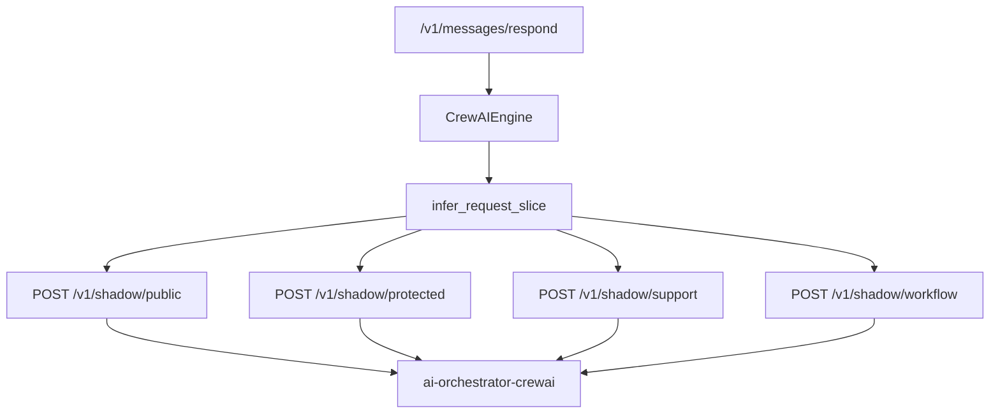
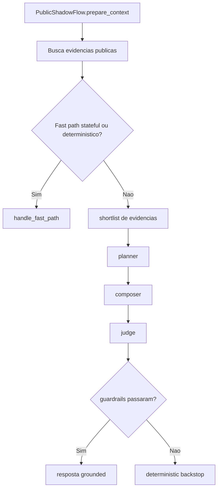
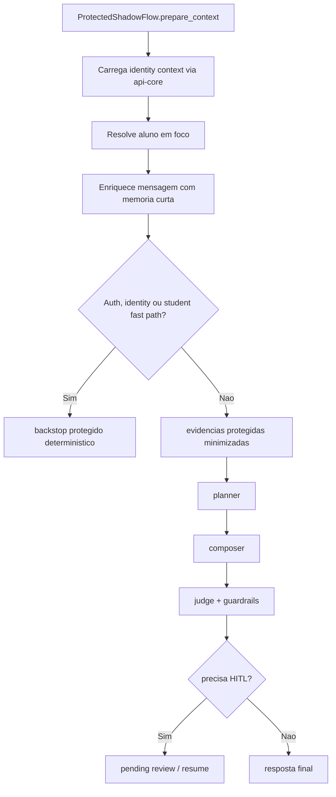

# Fluxo Detalhado do CrewAI

## 1. Adapter no runtime principal

## 2. Slice public

## 3. Slice protected

Notas:

- o `CrewAI` roda em servico isolado
- `Flow` e persistido por slice
- quando o piloto nao consegue devolver `answer_text`, o adapter pode cair em fallback explicito
