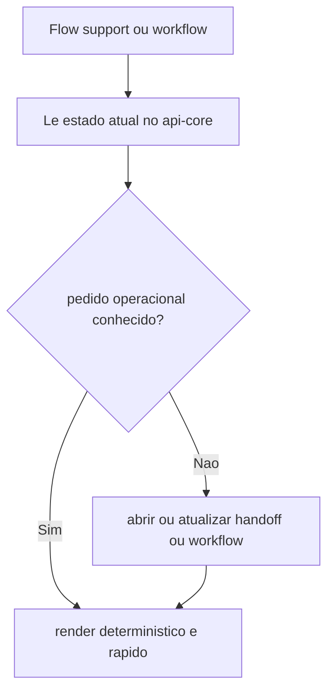
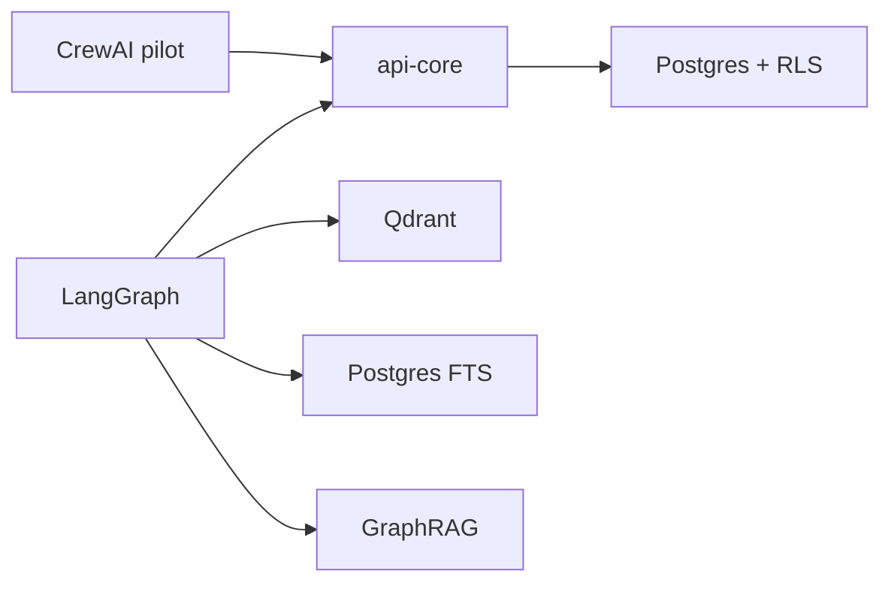
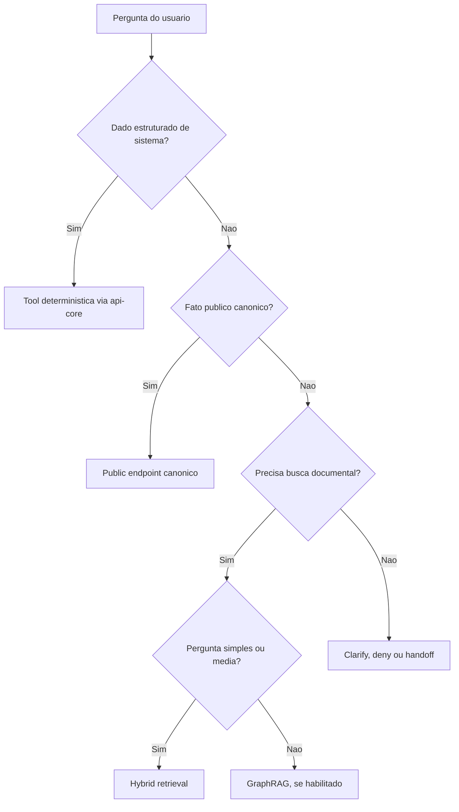

# Operacao, Fontes de Verdade e Estrategia de Dados

## 1. Support e workflow no CrewAI

## 2. Fontes de verdade por stack

## 3. Quando o sistema usa cada estrategia

Resumo:

- `LangGraph` concentra o plano de retrieval avancado
- `CrewAI` concentra `Flow`, estado por slice e composicao agentic
- ambos compartilham contratos, auth, traces e fontes de verdade
