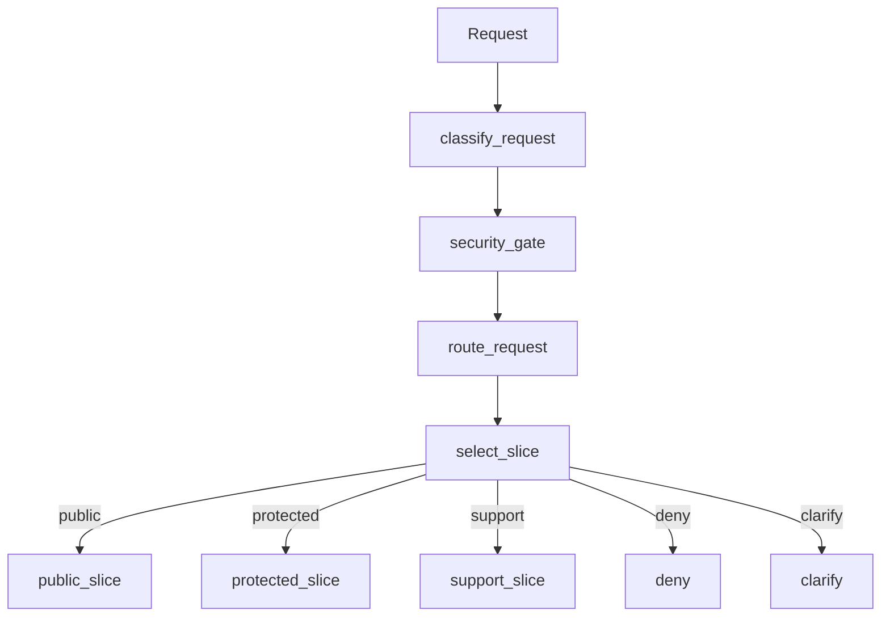
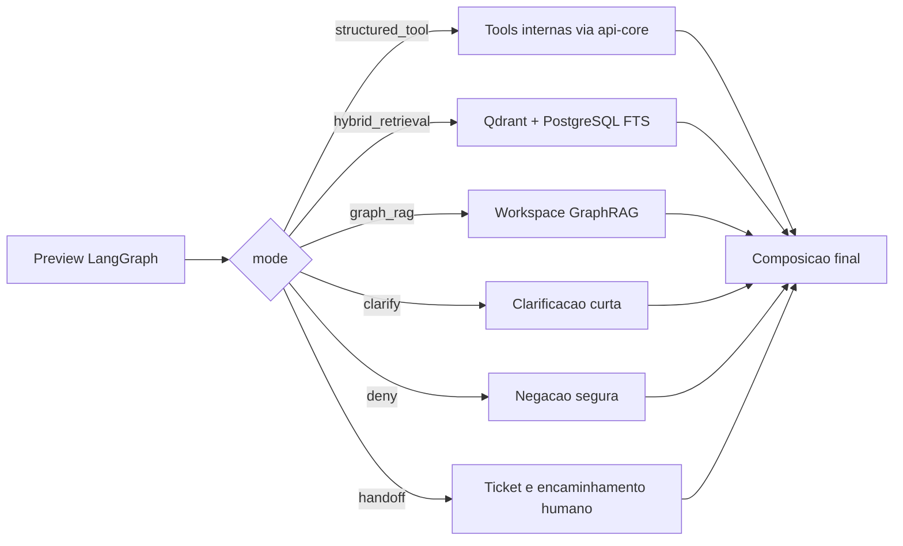
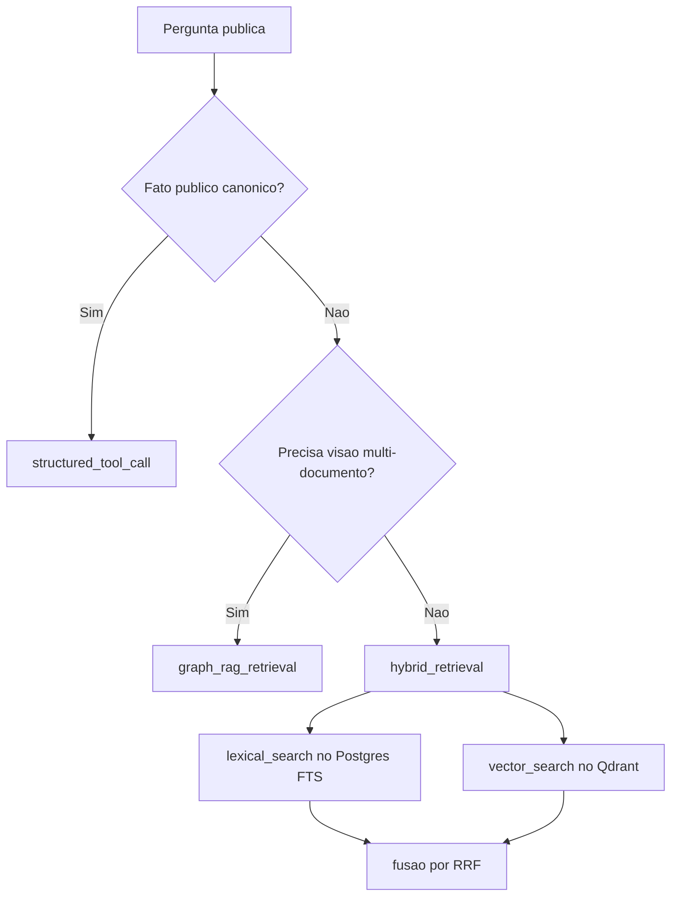

# Fluxo Detalhado do LangGraph

## 1. Planejamento do grafo

## 2. O que acontece depois do preview

## 3. Decisao de retrieval no slice publico

Notas:

- `protected` e `support` podem entrar em `HITL`
- `structured_tool` e preferido quando ha fonte estruturada confiavel
- `GraphRAG` nao e o default; ele entra quando a pergunta exige visao global do corpus
