# Guia Visual do Runtime Dual Stack

Este documento explica, de forma didatica e visual, como o runtime atual do EduAssist decide entre `LangGraph` e `CrewAI`, como cada stack executa os fluxos conversacionais e onde cada resposta busca seus dados nas fontes de verdade.

Objetivos:

- mostrar o caminho real da request;
- deixar claro onde entra `feature flag`, `runtime override`, canario e shadow;
- explicar quando o sistema usa tool deterministica, `hybrid retrieval` ou `GraphRAG`;
- reforcar que `LLM`, `LangGraph` e `CrewAI` nao sao fonte de verdade.

## 1. Visao Geral

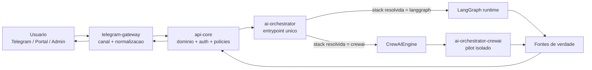

Leitura rapida:

- toda conversa entra pelo `ai-orchestrator`;
- o orquestrador resolve qual stack responde aquela request;
- as duas stacks compartilham a mesma superficie de produto;
- os dados continuam vindo de `api-core`, `Postgres`, `Qdrant` e artefatos de `GraphRAG`.

## 2. Como a Stack Primaria e Resolvida

Hoje a ordem de prioridade e:

1. `runtime override`
2. `feature flag`
3. `orchestrator_engine` do ambiente

Separadamente, existe o experimento por slice, que pode mandar algumas requests para `CrewAI` mesmo quando o primario continua `LangGraph`.

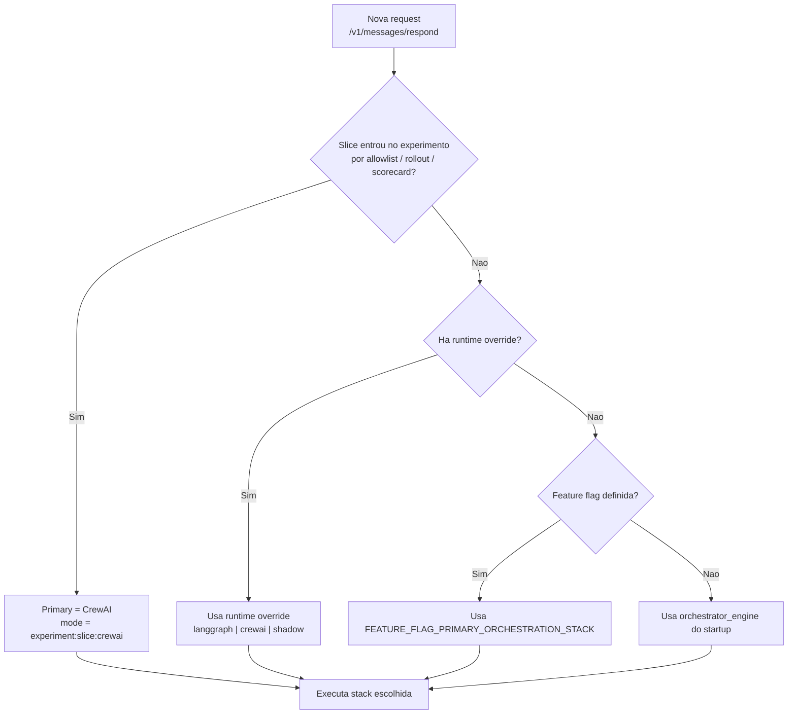

## 3. O Que e Fonte de Verdade Neste Repo

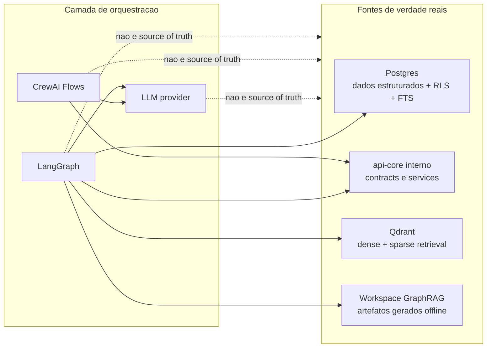

Regra pratica:

- dados estruturados de aluno, financeiro, identidade, protocolo e workflow: `api-core` + `Postgres`;
- fatos publicos canonicamente publicados: endpoints publicos do `api-core`;
- perguntas documentais: `Qdrant + PostgreSQL FTS`;
- perguntas multi-documento e corpus-level: `GraphRAG`, quando habilitado;
- `LLM` apenas compoe, resume ou melhora a linguagem dentro desses limites.

## 4. Fluxo LangGraph

### 4.1 Planejamento do grafo

O `LangGraph` faz primeiro o planejamento do turno, e so depois executa a estrategia escolhida.

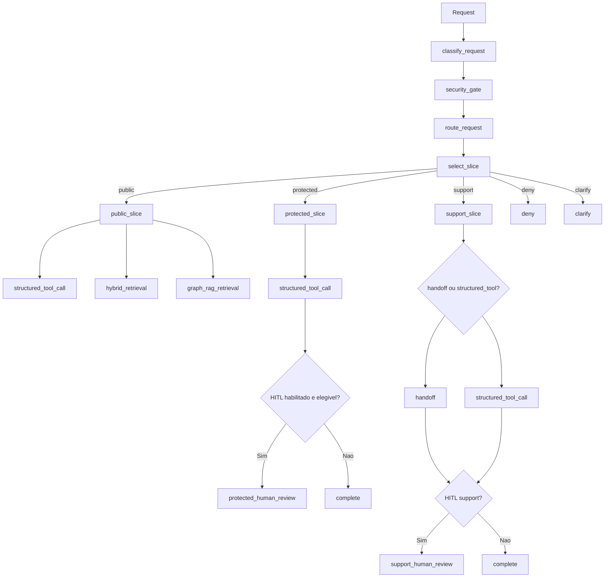

### 4.2 O que acontece depois do preview

Depois que o preview do grafo define o modo, o runtime executa uma de quatro familias:

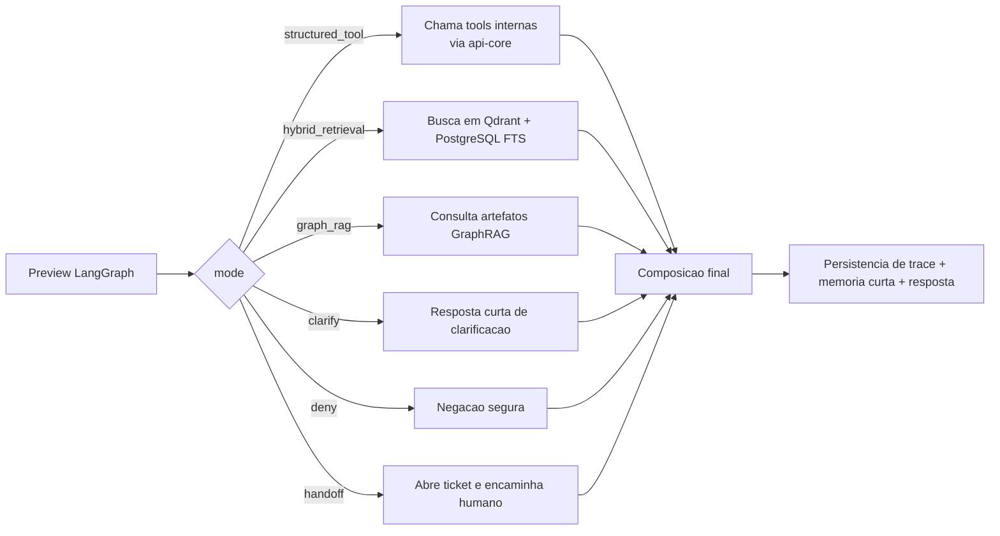

### 4.3 Quando LangGraph usa retrieval

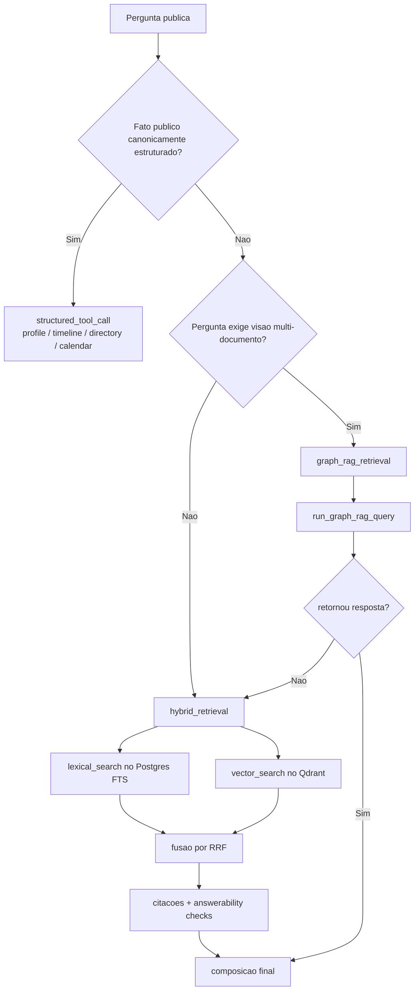

### 4.4 Fontes de verdade do LangGraph

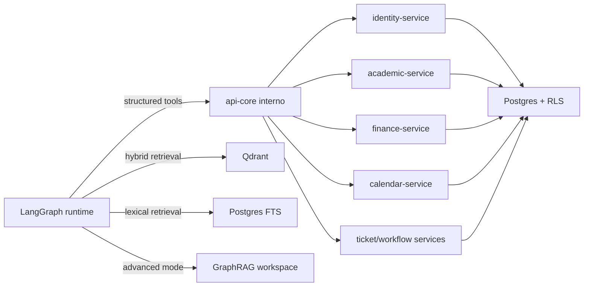

## 5. Fluxo CrewAI

No runtime principal, o `CrewAI` entra por um engine adapter que escolhe o slice e chama o piloto remoto isolado.

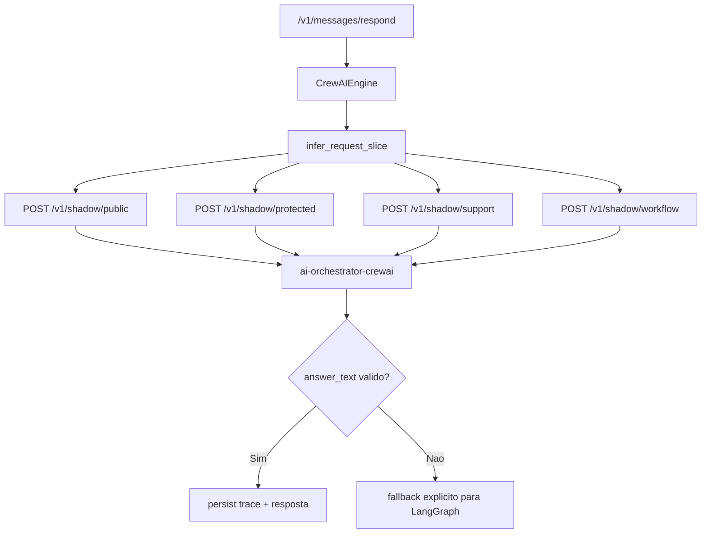

### 5.1 Slice `public` no CrewAI

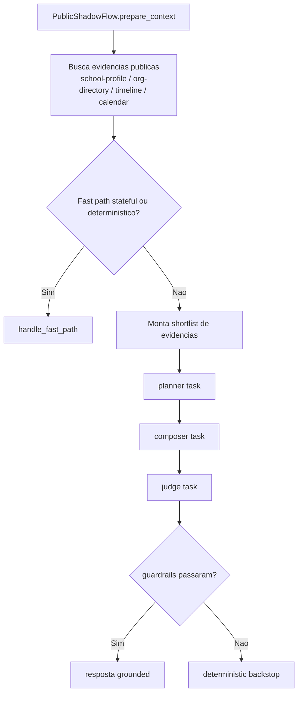

Caracteristicas:

- usa `Flow` com estado persistido;
- usa evidencias publicas do `api-core`, nao banco direto;
- faz `planner -> composer -> judge` apenas quando fast path nao resolve;
- usa guardrails e backstop para evitar drift.

### 5.2 Slice `protected` no CrewAI

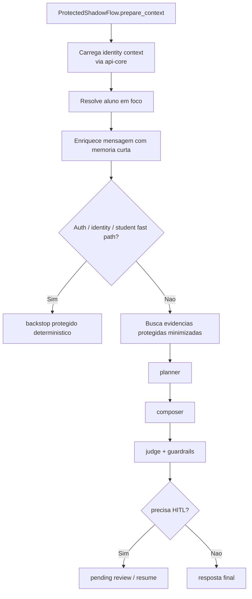

Caracteristicas:

- fonte de verdade continua sendo `api-core`;
- o flow persiste `student focus`, `domain` e `attribute`;
- quando o caso e sensivel, entra `HITL` em vez de arriscar resposta errada;
- se o caminho agentic falha, o piloto devolve fallback seguro, nao `500`.

### 5.3 Slice `support` no CrewAI

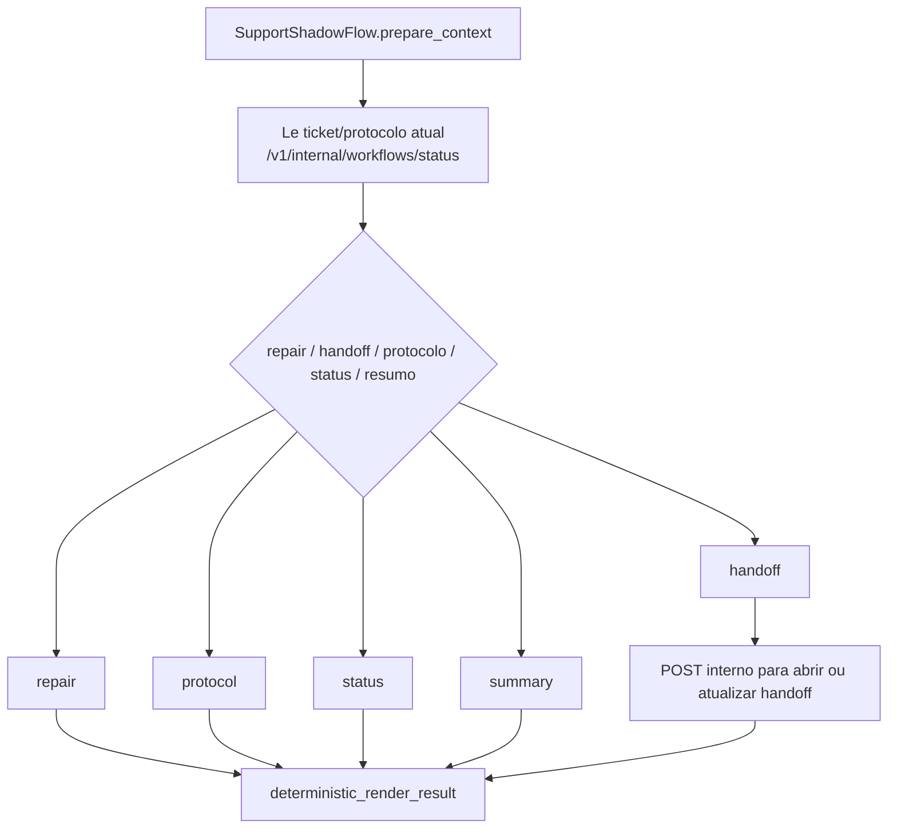

Caracteristicas:

- `support` usa `Flow` para continuidade de estado;
- mas a linguagem final e leve e deterministica, para latencia baixa;
- nao usa crew pesado quando a operacao ja esta resolvida pelo `api-core`.

### 5.4 Slice `workflow` no CrewAI

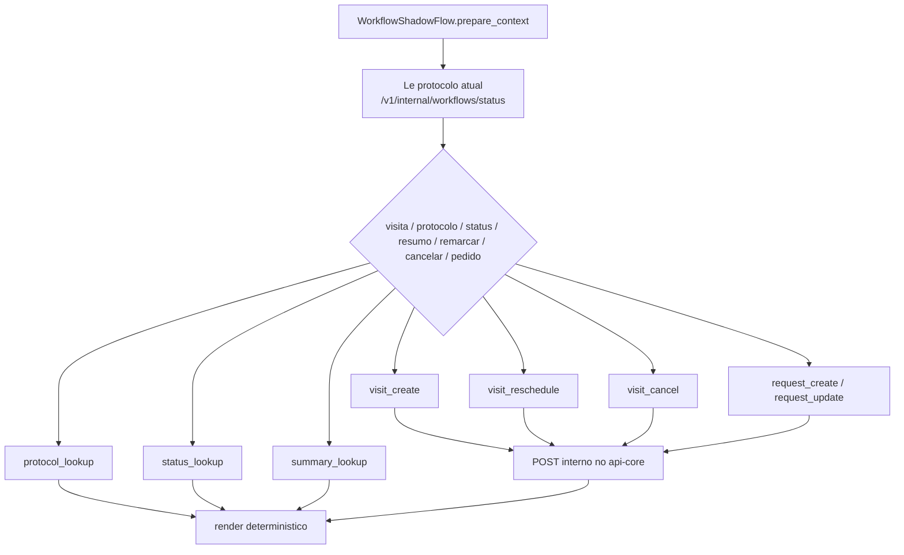

## 6. CrewAI e Fontes de Verdade

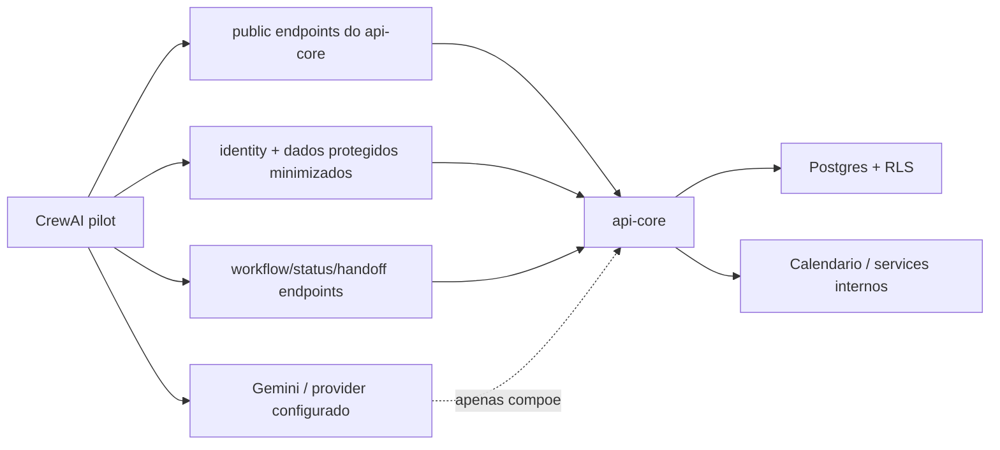

Ponto importante:

- no desenho atual, o `CrewAI` nao faz `hybrid retrieval` em `Qdrant` para o slice publico;
- ele usa evidencias publicas canonicamente montadas pelo `api-core`;
- o modo `GraphRAG` tambem nao roda dentro do piloto `CrewAI` hoje;
- ou seja, o piloto e forte em `Flow`, estado, guardrails e composicao, mas o plano de retrieval avancado continua concentrado no runtime `LangGraph`.

## 7. Quando o Sistema Usa Cada Estrategia de Dados

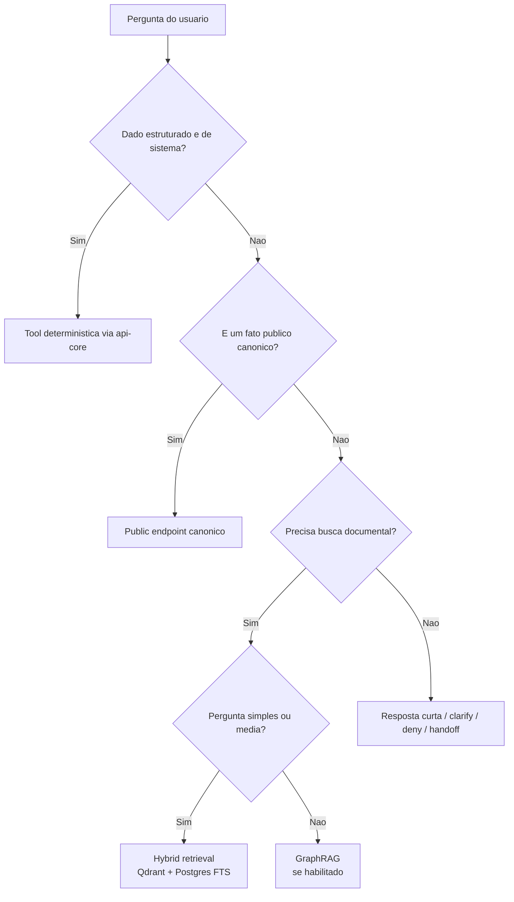

Resumo pratico:

- `tool deterministica`: notas, faltas, financeiro, identidade, protocolo, visita, handoff;
- `public endpoint canonico`: perfil da escola, diretorio, timeline, calendario publico;
- `hybrid retrieval`: documentos institucionais e FAQ mais aberta;
- `GraphRAG`: visao global do corpus, conexao entre varios documentos.

## 8. Diferenca Conceitual Entre as Duas Stacks

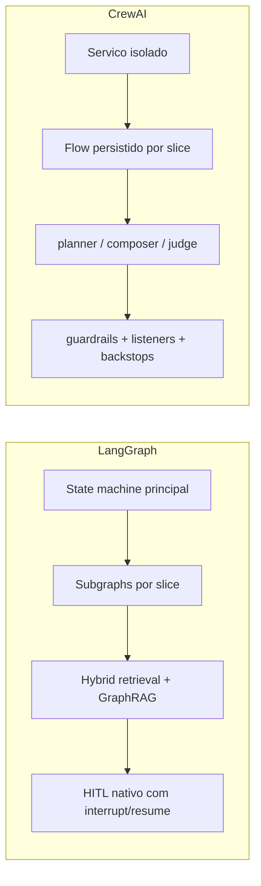

Leitura curta:

- `LangGraph` concentra o plano completo de orquestracao e retrieval;
- `CrewAI` concentra `Flow`, continuidade de estado, composicao agentic e guardrails por slice;
- ambos compartilham contratos, auth, traces e fontes de verdade.

## 9. Onde Procurar no Codigo

- entrada principal: [main.py](/home/edann/projects/eduassist-platform/apps/ai-orchestrator/src/ai_orchestrator/main.py)
- selecao de stack e canario: [engine_selector.py](/home/edann/projects/eduassist-platform/apps/ai-orchestrator/src/ai_orchestrator/engine_selector.py)
- grafo LangGraph: [graph.py](/home/edann/projects/eduassist-platform/apps/ai-orchestrator/src/ai_orchestrator/graph.py)
- runtime LangGraph e composicao: [runtime.py](/home/edann/projects/eduassist-platform/apps/ai-orchestrator/src/ai_orchestrator/runtime.py)
- runtime de checkpoint/HITL LangGraph: [langgraph_runtime.py](/home/edann/projects/eduassist-platform/apps/ai-orchestrator/src/ai_orchestrator/langgraph_runtime.py)
- adapter CrewAI no orquestrador: [crewai_engine.py](/home/edann/projects/eduassist-platform/apps/ai-orchestrator/src/ai_orchestrator/engines/crewai_engine.py)
- servico isolado CrewAI: [main.py](/home/edann/projects/eduassist-platform/apps/ai-orchestrator-crewai/src/ai_orchestrator_crewai/main.py)
- flow publico CrewAI: [public_flow.py](/home/edann/projects/eduassist-platform/apps/ai-orchestrator-crewai/src/ai_orchestrator_crewai/public_flow.py)
- flow protegido CrewAI: [protected_flow.py](/home/edann/projects/eduassist-platform/apps/ai-orchestrator-crewai/src/ai_orchestrator_crewai/protected_flow.py)
- flow de suporte CrewAI: [support_flow.py](/home/edann/projects/eduassist-platform/apps/ai-orchestrator-crewai/src/ai_orchestrator_crewai/support_flow.py)
- flow de workflow CrewAI: [workflow_flow.py](/home/edann/projects/eduassist-platform/apps/ai-orchestrator-crewai/src/ai_orchestrator_crewai/workflow_flow.py)
- ADR de retrieval: [0002-retrieval-and-agent-runtime.md](/home/edann/projects/eduassist-platform/docs/adr/0002-retrieval-and-agent-runtime.md)

## 10. Regra de Ouro

Se surgir duvida sobre "de onde veio essa resposta?", siga esta ordem:

1. verifique qual stack respondeu;
2. descubra o slice;
3. descubra o modo:
   - `structured_tool`
   - `hybrid_retrieval`
   - `graph_rag`
   - `clarify`
   - `handoff`
4. so depois olhe para a LLM.

Na maior parte dos casos, o erro esta em:

- roteamento errado;
- contexto errado;
- fonte de verdade errada;
- ou retrieval inadequado para a pergunta.

Nao comeca na LLM.
