# Guia Visual Macro do Runtime Dual Stack

Este guia e o mapa geral do sistema. Ele foi escrito para quem quer entender o todo antes de mergulhar em uma stack especifica.

Se voce preferir ver os detalhes por tecnologia, use estes guias:

- [Guia visual do LangGraph](./langgraph-runtime-visual-guide.md)
- [Guia visual do CrewAI](./crewai-runtime-visual-guide.md)

Este arquivo continua em formato `preview-safe` para o `Open Preview` do VS Code: os diagramas aparecem como SVGs gerados a partir do Mermaid, em vez de Mermaid inline.

## Como pensar no sistema

Uma forma simples de entender o projeto e esta:

1. o usuario faz uma pergunta
2. o sistema identifica o contexto da conversa
3. o orquestrador escolhe qual stack vai responder
4. a stack escolhida busca dados nas fontes de verdade
5. o sistema monta a resposta e registra rastros para auditoria

O ponto mais importante e este: `LangGraph` e `CrewAI` nao sao os bancos de dados do sistema. Eles sao os motores de decisao e composicao. Os dados confiaveis vivem em outras fontes.

## 1. Mapa geral do sistema

### 1.1 Fluxo macro da request

  

Leitura simples:

- a mensagem entra por um canal, como Telegram ou portal
- ela passa pelo `api-core`, que conhece regras de dominio, autenticacao e politicas
- depois chega ao `ai-orchestrator`, que e o ponto central de decisao
- dali a request segue para `LangGraph` ou para `CrewAI`
- no fim, as duas stacks consultam as mesmas fontes de verdade

Em outras palavras: existe `um so sistema`, mas com `duas formas de orquestrar` a resposta.

### 1.2 Como o sistema decide entre LangGraph e CrewAI

  

Leitura simples:

- primeiro o sistema verifica se a request entrou num experimento controlado por slice
- se nao entrou, ele olha se existe um `runtime override`
- se nao existir override, ele olha a `feature flag`
- se nada disso estiver definido, ele usa o default de startup

O que isso significa na pratica:

- a stack que responde pode mudar sem trocar o contrato externo
- o usuario continua falando com o mesmo produto
- o time consegue comparar `LangGraph` e `CrewAI` com seguranca

### 1.3 O que realmente e fonte de verdade

  

Interpretacao correta:

- `Postgres` guarda dados estruturados do sistema
- `api-core` expoe contratos internos e aplica regras de negocio
- `Qdrant` ajuda na busca semantica de documentos
- `GraphRAG` ajuda quando a pergunta pede visao mais global do corpus
- `LLM`, `LangGraph` e `CrewAI` usam essas fontes, mas nao substituem essas fontes

Se uma resposta estiver errada, a causa quase sempre esta em uma destas camadas:

- roteamento
- contexto
- escolha da fonte
- estrategia de retrieval

Raramente o problema comeca “na LLM pura”.

## 2. O caminho de uma pergunta, do jeito mais simples possivel

Quando o usuario manda uma pergunta, o sistema tenta responder a quatro perguntas internas:

1. `quem esta perguntando?`
   Isso define autenticacao, escopo de acesso e risco.

2. `sobre o que e a pergunta?`
   Isso ajuda a descobrir o slice certo: `public`, `protected`, `support` ou `workflow`.

3. `qual stack deve responder esta request?`
   Aqui entra a logica de feature flag, override e canario.

4. `qual fonte de verdade eu preciso consultar?`
   Nem toda pergunta precisa de LLM ou retrieval pesado.

Essa ordem e importante porque evita duas coisas:

- gastar latencia onde nao precisa
- responder com aparencia convincente, mas baseada na fonte errada

## 3. Como os dados sao buscados no mundo real

### 3.1 Fontes de verdade por stack

  

Leitura simples:

- o `LangGraph` costuma concentrar retrieval mais avancado
- o `CrewAI` costuma concentrar `Flow`, estado por slice e composicao agentic
- os dois compartilham a mesma infraestrutura de dados e contratos internos

Isso quer dizer que a diferenca principal entre as stacks nao esta em “qual banco elas usam”. A diferenca esta em `como elas pensam a execucao`.

### 3.2 Quando o sistema usa cada estrategia

  

Interpretacao didatica:

- se o dado e estruturado e confiavel, o sistema prefere tool deterministica
- se a resposta publica ja e canonica, ele tenta um caminho rapido
- se a pergunta precisa buscar documentos, ele decide entre retrieval simples ou mais avancado
- se nem retrieval nem tool resolvem, ele pode pedir clarificacao, negar ou abrir handoff

Essa e a regra tecnica mais importante do projeto:

`nao usar LLM pesada por default quando um caminho estruturado e grounded ja resolve`.

## 4. O papel de cada stack

### 4.1 LangGraph, em uma frase

O `LangGraph` e a stack mais forte quando o problema parece um `grafo de decisao com estados e caminhos explicitos`.

Ele brilha em:

- planejamento de grafo
- controle de execucao
- persistencia de checkpoints
- human-in-the-loop
- retrieval mais sofisticado

### 4.2 CrewAI, em uma frase

O `CrewAI` e a stack mais forte quando o problema parece um conjunto de `flows persistidos por slice`, com passos bem definidos, outputs estruturados e composicao agentic mais enxuta.

Ele brilha em:

- flows com estado tipado
- isolamento por slice
- resposta rapida em caminhos bem modelados
- composicao controlada de tarefas
- adaptacao de comportamento por dominio

## 5. Como depurar sem se perder

Se surgir a pergunta `de onde veio esta resposta?`, siga esta ordem:

1. descubra qual stack respondeu
2. descubra qual slice foi escolhido
3. descubra qual modo foi usado
   Exemplo: fast path, retrieval, handoff, HITL, fallback.
4. descubra qual fonte de verdade foi consultada
5. so depois examine a LLM

Esse metodo economiza muito tempo. Ele evita culpar a LLM quando o erro real foi:

- um follow-up que herdou o contexto errado
- um parser que puxou o aluno errado
- um slice que foi escolhido de forma errada
- um fallback que perdeu informacao

## 6. Qual guia ler depois

Leia o [Guia visual do LangGraph](./langgraph-runtime-visual-guide.md) se voce quiser entender:

- como o grafo decide entre tool, retrieval, GraphRAG, clarify, deny e handoff
- como o runtime reaproveita contexto e monta respostas
- por que o LangGraph e mais forte em controle de fluxo

Leia o [Guia visual do CrewAI](./crewai-runtime-visual-guide.md) se voce quiser entender:

- como o adapter no orquestrador conversa com o servico isolado
- como os `Flows` funcionam por slice
- por que o `CrewAI` fica tao rapido quando o flow esta bem desenhado

## 7. Exemplo real de pergunta do usuario

Vamos usar uma pergunta protegida simples:

`Qual a documentacao do Lucas?`

### O que o usuario enxerga

Para o usuario, parece so isto:

1. ele manda a pergunta no Telegram ou no portal
2. o sistema “entende” que ele quer saber algo sobre o aluno Lucas
3. a resposta volta com a situacao documental

### O que o sistema faz por baixo

Na arquitetura real, o caminho e este:

1. o canal entrega a mensagem para o `api-core`
2. o `api-core` valida identidade, sessao e contexto da conta
3. o `ai-orchestrator` recebe a request
4. ele decide qual stack vai responder
   Pode ser `LangGraph` ou `CrewAI`, dependendo de override, feature flag ou experimento
5. o sistema detecta que isso e `protected`
6. a stack escolhida consulta as fontes de verdade
   Normalmente via `api-core` e dados estruturados em `Postgres`
7. a resposta final e montada e devolvida ao usuario
8. traces e auditoria sao registrados

### O ponto mais importante desse exemplo

Mesmo que a orquestracao mude, a pergunta continua batendo nas mesmas verdades de negocio.

Ou seja:

- a stack muda `como pensar`
- mas nao deveria mudar `o que e verdade`

Esse exemplo mostra a ideia central do projeto:

`duas stacks, um contrato externo, as mesmas fontes de verdade`.

## 8. Glossario rapido

`slice`

E um recorte do problema. No projeto, os principais sao:

- `public`: perguntas abertas e institucionais
- `protected`: perguntas autenticadas e sensiveis
- `support`: pedidos de atendimento e acompanhamento
- `workflow`: operacoes como agendar, remarcar ou cancelar

`feature flag`

E uma chave de configuracao que muda o comportamento do sistema sem mudar o contrato externo. Aqui ela ajuda a trocar a stack principal entre `LangGraph` e `CrewAI`.

`runtime override`

E uma troca temporaria feita com o app rodando. Serve para forcar uma stack sem reiniciar o servico.

`fonte de verdade`

E o lugar que realmente guarda o dado confiavel. Exemplo: `Postgres`, `api-core`, `Qdrant` e `GraphRAG`, dependendo do caso.

`retrieval`

E o processo de buscar informacoes relevantes antes de responder. Nem todo retrieval e igual:

- alguns casos usam dado estruturado
- outros usam busca documental
- outros usam visao mais ampla do corpus

`fallback`

E o caminho de seguranca usado quando o caminho ideal nao fecha bem. O objetivo e evitar erro grave ou quebra da conversa.

`HITL`

Significa `human-in-the-loop`. Em portugues: existe uma etapa de revisao humana antes da resposta final em casos mais sensiveis.

`trace`

E o rastro tecnico da request. Ele ajuda a responder perguntas como:

- qual stack respondeu?
- qual slice foi escolhido?
- qual fonte de verdade foi usada?

## Onde procurar no codigo

- entrada principal: [main.py](../../apps/ai-orchestrator/src/ai_orchestrator/main.py)
- selecao de stack e canario: [engine_selector.py](../../apps/ai-orchestrator/src/ai_orchestrator/engine_selector.py)
- adapter CrewAI no orquestrador: [crewai_engine.py](../../apps/ai-orchestrator/src/ai_orchestrator/engines/crewai_engine.py)
- runtime LangGraph e composicao: [runtime.py](../../apps/ai-orchestrator/src/ai_orchestrator/runtime.py)
- grafo LangGraph: [graph.py](../../apps/ai-orchestrator/src/ai_orchestrator/graph.py)
- servico isolado CrewAI: [main.py](../../apps/ai-orchestrator-crewai/src/ai_orchestrator_crewai/main.py)
- ADR de retrieval: [0002-retrieval-and-agent-runtime.md](../adr/0002-retrieval-and-agent-runtime.md)

## Fontes Mermaid

Os fontes originais dos diagramas continuam versionados aqui:

- [mermaid-src/dual-stack-runtime-visual-overview.md](./mermaid-src/dual-stack-runtime-visual-overview.md)
- [mermaid-src/dual-stack-langgraph-visual-flow.md](./mermaid-src/dual-stack-langgraph-visual-flow.md)
- [mermaid-src/dual-stack-crewai-visual-flow.md](./mermaid-src/dual-stack-crewai-visual-flow.md)
- [mermaid-src/dual-stack-data-retrieval-visual-flow.md](./mermaid-src/dual-stack-data-retrieval-visual-flow.md)
