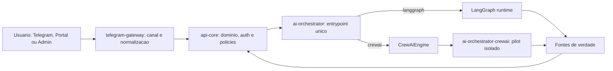
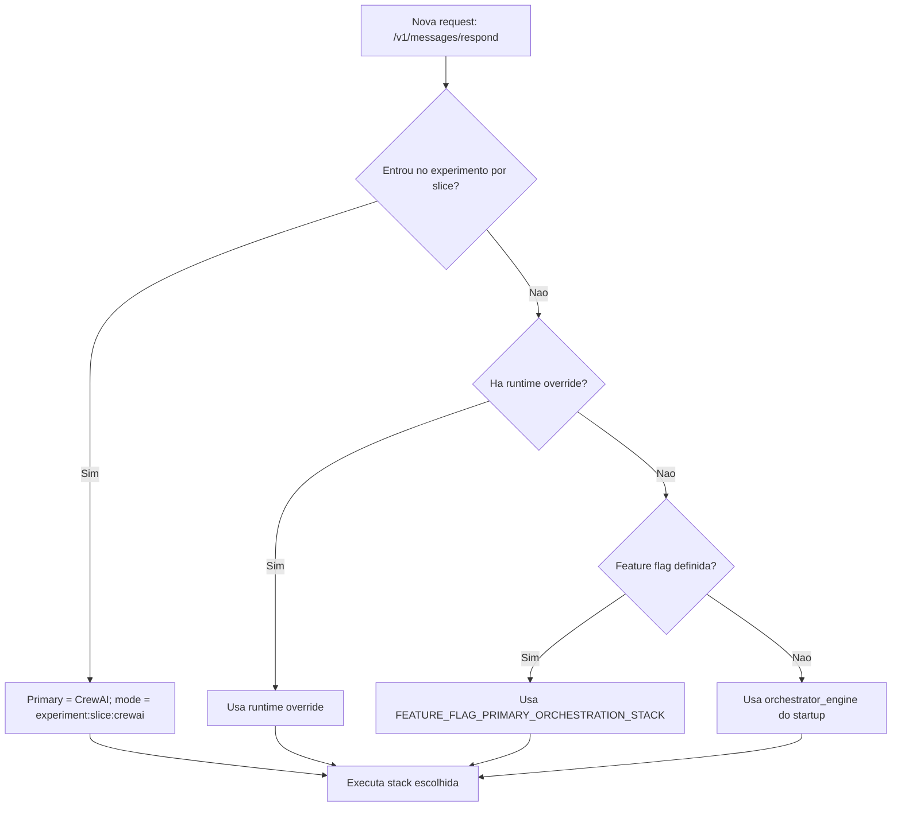
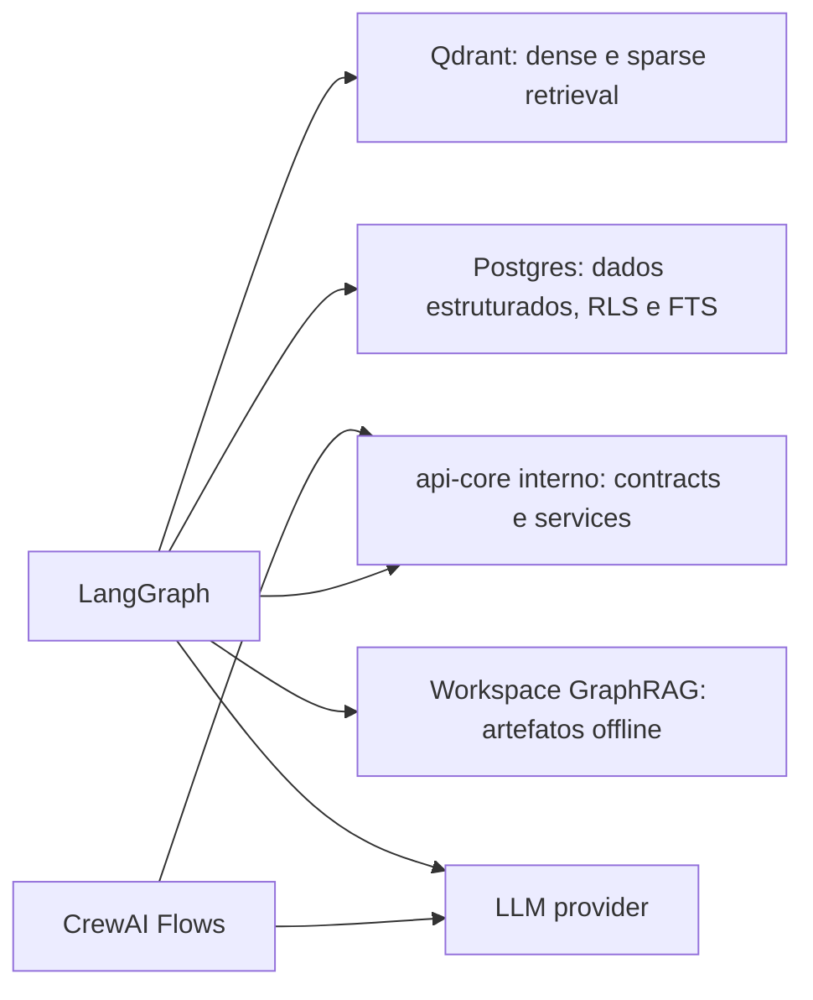

# Visao Geral e Resolucao de Stack

## 1. Visao Geral

## 2. Como a stack primaria e resolvida

## 3. O que e fonte de verdade

Resumo:

- dados estruturados: `api-core` + `Postgres`
- dados documentais: `Qdrant + PostgreSQL FTS`
- corpus-level: `GraphRAG`
- `LLM`, `LangGraph` e `CrewAI` nao sao fonte de verdade
