# Guia Visual do LangGraph

Este guia explica apenas o lado `LangGraph` do sistema. A ideia aqui e responder a pergunta:

`Quando a request cai no LangGraph, o que acontece de verdade?`

Se voce quiser ver o mapa completo antes, use o [Guia visual macro do runtime dual stack](./dual-stack-runtime-visual-guide.md).

## Como pensar no LangGraph

Pense no `LangGraph` como um `roteador com memoria e passos explicitos`.

Ele nao faz so “chamar uma LLM”. Ele tenta decidir:

- qual caminho seguir
- qual contexto reaproveitar
- quando usar dado estruturado
- quando usar retrieval
- quando pedir clarificacao
- quando negar ou escalar

Essa e a forca dele: `controle de execucao`.

## 1. Planejamento do grafo

  

Leitura simples:

- a request entra no grafo
- o sistema entende o slice e o tipo de tarefa
- ele decide se a resposta vem de:
  - `structured_tool`
  - retrieval
  - `handoff`
  - `clarify`
  - `deny`

Esse planejamento existe para evitar improviso desnecessario. O grafo tenta ser explicito sobre `o que esta acontecendo`.

### Como isso ajuda na pratica

- melhora auditoria
- reduz respostas “convincentes mas erradas”
- facilita achar bugs de roteamento

## 2. O que acontece depois do preview

  

Depois de decidir o caminho, o runtime faz o trabalho pesado:

- busca contexto recente da conversa
- recupera fatos relevantes
- monta um `answer frame` ou uma resposta grounded
- renderiza o texto final

Aqui vale uma ideia importante:

`o texto final nao deveria ser um monte de if/else hardcoded`.

O projeto tenta separar duas coisas:

- `controle`: qual caminho seguir
- `expressao`: como falar com o usuario

Por isso existem fast paths e renderizacao natural, em vez de so devolver frases prontas.

## 3. Como o LangGraph decide retrieval no slice publico

  

Este diagrama responde uma duvida muito comum:

`Quando o sistema usa tool, retrieval simples ou GraphRAG?`

Leitura pratica:

- se ha fonte estruturada confiavel, ele prefere tool
- se ha resposta publica canonica, ele tenta o caminho rapido
- se precisa buscar em documentos, ele pode usar retrieval
- se a pergunta pede visao mais ampla do corpus, pode entrar `GraphRAG`

O `GraphRAG` nao e o padrao. Ele e uma ferramenta mais pesada, usada quando realmente agrega valor.

## 4. O que o LangGraph faz melhor

Hoje, no desenho deste projeto, o `LangGraph` e especialmente forte em:

- `protected`, onde controle e confiabilidade pesam mais
- fluxos com checkpoint e HITL
- cenarios onde a pergunta muda de forma no meio da conversa
- casos em que retrieval precisa ser mais sofisticado

Em termos simples:

- `CrewAI` costuma ser muito eficiente em flows bem fechados
- `LangGraph` costuma ser muito forte quando a conversa pede mais controle estrutural

## 5. Onde entram as fontes de verdade

Quando o `LangGraph` precisa de fatos, ele normalmente passa por estas camadas:

1. `api-core`
   Para contratos internos, regras de negocio e tools.

2. `Postgres`
   Para dados estruturados e, em alguns cenarios, FTS.

3. `Qdrant`
   Para retrieval vetorial.

4. `GraphRAG`
   Para perguntas com necessidade de visao corpus-level.

Isso significa que, mesmo quando o usuario “fala com o LangGraph”, a resposta correta depende da fonte certa estar sendo consultada.

## 6. Como diagnosticar um problema no LangGraph

Se uma resposta vier ruim, a ordem boa de investigacao e:

1. o slice foi escolhido corretamente?
2. o preview do grafo escolheu o modo certo?
3. a fonte de verdade estava correta?
4. houve reuse correto do contexto recente?
5. o renderer final perdeu algum fato?

Erros comuns que parecem “problema de LLM”, mas nao sao:

- follow-up herdando foco errado
- parser prendendo no aluno errado
- retrieval pesado entrando onde um tool resolveria
- `clarify` disparando tarde demais

## 7. Como ler os traces do LangGraph

Quando voce olhar um trace, tente procurar:

- `graph_path`
- `state`
- `thread_id`
- se houve `structured_tool`, retrieval, `handoff` ou `HITL`

Esses sinais costumam explicar mais do que olhar apenas o texto final.

## 8. Exemplo real de pergunta do usuario no LangGraph

Vamos usar este exemplo:

`Quero ver as notas do Lucas`

### O que a pessoa acha que aconteceu

Do ponto de vista do usuario, parece algo simples:

1. ele pede as notas
2. o sistema reconhece Lucas
3. a resposta volta com a informacao certa

### O que o LangGraph faz de verdade

Por baixo, o caminho tende a ser mais ou menos este:

1. o runtime recebe a request ja contextualizada
2. o grafo entende que a pergunta e `protected`
3. ele decide se isso pode sair por `structured_tool`
4. como notas sao dado estruturado e sensivel, ele prefere um caminho confiavel
5. consulta a fonte de verdade via contratos internos
6. reaproveita o foco recente do aluno, se esse contexto estiver forte
7. monta um `answer frame`
8. renderiza a resposta final com texto natural

### Por que isso e diferente de “so chamar uma LLM”

O LangGraph nao deveria responder essa pergunta “inventando” uma explicacao livre.

Ele tenta fazer isto:

- primeiro descobrir o caminho certo
- depois buscar o fato certo
- so entao falar com linguagem natural

Isso ajuda muito em dominios sensiveis, porque reduz o risco de uma resposta bonita, mas errada.

### Quando esse exemplo da problema

Os erros mais comuns aqui sao:

- o foco do aluno veio errado
- o slice foi detectado errado
- a conversa tinha follow-up ambiguo
- o renderer final resumiu mal o fato recuperado

Quando isso acontece, o melhor lugar para investigar e:

- `graph_path`
- `thread_id`
- `state`
- e o ponto onde o `structured_tool` foi ou nao foi escolhido

## 9. Arquivos mais importantes

- runtime e composicao: [runtime.py](../../apps/ai-orchestrator/src/ai_orchestrator/runtime.py)
- grafo principal: [graph.py](../../apps/ai-orchestrator/src/ai_orchestrator/graph.py)
- runtime de checkpoint e HITL: [langgraph_runtime.py](../../apps/ai-orchestrator/src/ai_orchestrator/langgraph_runtime.py)
- entrada HTTP: [main.py](../../apps/ai-orchestrator/src/ai_orchestrator/main.py)
- ADR de retrieval: [0002-retrieval-and-agent-runtime.md](../adr/0002-retrieval-and-agent-runtime.md)
