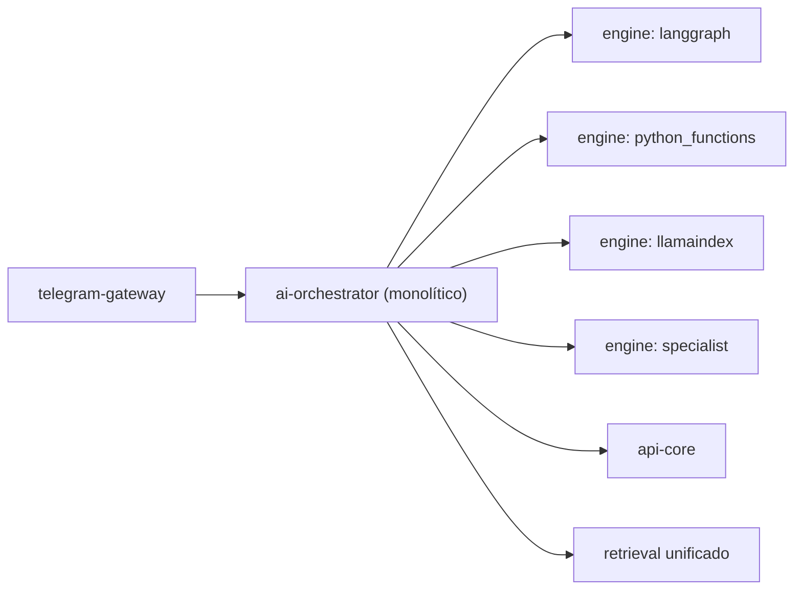
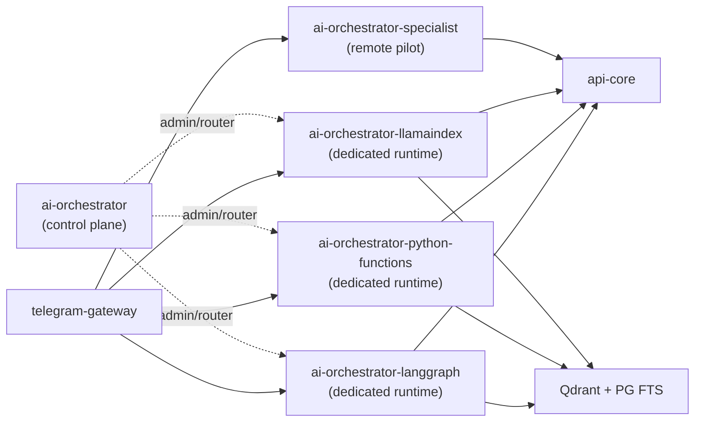

# Relatório de Auditoria Técnica — EduAssist Platform (Abril 2026)

> Análise completa do codebase após o refactoring **Dedicated-First**, com comparação ao estado da arte em orquestração agêntica, RAG, segurança e observabilidade.

---

## 1. Resumo Executivo

O EduAssist Platform passou por uma transformação arquitetural profunda: migrou de um **orquestrador central monolítico** com múltiplos "engines" para um modelo de **quatro runtimes dedicados e independentes** que compartilham apenas a infraestrutura de dados e segurança. O `ai-orchestrator` original foi rebaixado a **Control Plane / Router** — ele não serve mais respostas diretamente ao usuário e é usado apenas como ponte interna.

### Números-chave do codebase atual

| Métrica | Valor |
| :--- | :--- |
| Módulos Python no `ai-orchestrator/src` | **112 arquivos** |
| Tamanho do `runtime_core.py` (antigo gargalo) | **~46 KB** (1.872 linhas, refatorado para ser o core com submódulos) |
| Aplicações no monorepo | **6** (`api-core`, `ai-orchestrator`, `ai-orchestrator-specialist`, `telegram-gateway`, `worker`, `admin-web`) |
| Suítes E2E | **11 scripts** em `tests/e2e/` (incluindo parity, multi-turn e mem longa) |
| Targets no Makefile | **90** |
| Stacks de orquestração ativas | **4** (`langgraph`, `python_functions`, `llamaindex`, `specialist_supervisor`) |

---

## 2. Arquitetura Atual vs. Arquitetura Anterior

### 2.1. Antes: Orquestrador Central ("God Class")

**Problema**: O orquestrador central controlava roteamento, post-processing, polish final, composição de candidatos e retrieval. O `runtime.py` anterior continha lógicas aglomeradas, reduzindo a distância experimental entre as stacks e criando um gargalo de complexidade.

### 2.2. Agora: Dedicated-First

**Cada stack é um serviço FastAPI independente** com seu próprio entrypoint (`main_langgraph.py`, `main_python_functions.py`, `main_llamaindex.py` e `ai-orchestrator-specialist/main.py`). O entrypoint padronizado provisiona:
- `/healthz` e `/v1/status` para operações
- `/v1/messages/respond` como endpoint protegido (`X-Internal-Api-Token`)
- Observabilidade via OpenTelemetry

---

## 3. Análise das Quatro Stacks

### 3.1. Dados de Benchmark (Four-Path Comparison Report)

Baseado no relatório `retrieval-50q-cross-path-report.md` (Abril 2026):

| Stack | OK | Keyword Pass | Qualidade Média | Latência Média |
| :--- | :---: | :---: | :---: | :---: |
| **specialist_supervisor** | 50/50 | **41/50** | **94.8** | **1.402 ms** |
| **langgraph** | 48/50 | **41/50** | 92.3 | 5.254 ms |
| **python_functions** | 48/50 | 36/50 | 88.3 | 6.923 ms |
| **llamaindex** | 45/50 | 34/50 | 83.0 | 5.190 ms |

### 3.2. Análise Individual

#### Python Functions — O Caminho Determinístico
**Perfil**: Roteamento explícito e tipado, sem dependência de LLM para fluxos canônicos.
**Pontos fortes**:
- Pipeline de decisão direto implementado em `python_functions_native_plan_runtime.py` e `python_functions_native_runtime.py`.
- Resolve FAQs e dados protegidos chamando `api-core` antes do fallback de LLM.
**Comparação SOTA**: Implementa **"classify-then-direct"**, que preserva processamento determinístico para cenários triviais, otimizando custo. Apesar de no benchmark atual mostrar latência maior em fluxos complexos, sua previsibilidade é o padrão recomendado.

#### LangGraph — A Máquina de Estados
**Perfil**: Orquestração via grafo de estados (`langgraph_message_workflow.py`).
**Pontos fortes**:
- Nodes explícitos com estado, garantindo rastreabilidade e workflow resiliente.
- Capacidade robusta de HITL (Human-in-the-Loop) e fallback.
**Comparação SOTA**: Consolidado como o estado da arte para orquestração (framework-level governance), sua adoção aqui está alinhada a sistemas enterprise agênticos de 2026.

#### LlamaIndex — O Caminho Documental
**Perfil**: Usa `llamaindex_native_plan_runtime.py` focado fortemente na síntese e retrieval de acervo extenso.
**Pontos fortes**:
- Integra nativamente `QdrantVectorStore` e fluxos de workflow do próprio LlamaIndex (através do worker em background ou runtime principal).
- Final Polish acionado amplamente (24 de 50 requests no benchmark) devido à forte síntese documental.
**Comparação SOTA**: O uso do Workflow e pipelines LlamaIndex é altamente recomendado para a vertente "Data-Aware Agents".

#### Specialist Supervisor — O Caminho Premium
**Perfil**: Aplicação apartada (`ai-orchestrator-specialist`) rodando em modo quality-first.
**Pontos fortes**:
- Melhor qualidade e resiliência reportada (94.8, 50/50 OK), latência muito competitiva (1.402ms) na última run (significativamente otimizada vs antigas versões).
- Isolamento total, agindo como remote pilot que prioriza tool usage.
**Comparação SOTA**: Aplica *Graceful Degradation* e isolamento de runtime. Este isolamento de piloto especializado como API autônoma é fundamental para microsserviços maduros.

---

## 4. Semantic Ingress — Inovação Arquitetural

Implementado no subpacote compartilhado `semantic-ingress` (e `semantic_ingress_runtime.py`), ele atua antes do routing profundo:

| Ato | Papel no Roteamento |
| :--- | :--- |
| `greeting` / `capabilities` / `scope_boundary` | Resolução imediata sem acionar o motor pesado de busca ou RAG. |
| `auth_guidance` / `input_clarification` | Redirecionamento e saneamento sem gerar falsos positivos de intent. |

**Como funciona**:
Usa LLM para classificar (ou fallback determinístico) intenções da mensagem (`is_terminal_ingress_act`).
**Comparação SOTA**: Classificação baseada em *Semantic Guardrails* no ingress, poupando tokens e latência, que é mandatória para orquestradores de produção em 2026.

---

## 5. Recuperação de Informação (RAG)

### 5.1. Arquitetura Atual

| Componente | Papel |
| :--- | :--- |
| **Qdrant** (`qdrant_hybrid`) | Motor de busca vetorial densa, implementado no orquestrador e alimentado no `worker`. |
| **PostgreSQL FTS** | Motor léxico. |
| **MinIO** | Armazena documentos originais e evidências. |
| **Lazy/GraphRAG** | Usado sob demanda em workflows do LlamaIndex e LangGraph. |

### 5.2. Comparação com SOTA e Gaps

| Prática da Indústria (2026) | Status | Detalhes |
| :--- | :---: | :--- |
| RRF/Hybrid Retrieval | ✅ | `qdrant_hybrid` implementado em todas as runtimes. |
| Chunking e Payload Filtering | ✅ | Implementado via pipelines do `worker`. |
| Re-ranking com Cross-Encoder | ⚠️ | Ausente. Não há uso de `bge-reranker-v2` ou similar. Isso impacta as respostas compostas dos retrievers documentais. |

---

## 6. Segurança e Autorização

**Fluxo Sólido**:
1. O usuário é autenticado via Keycloak (`api-core`).
2. Gateway confere assinaturas Telegram e Idempotência.
3. Decisões contextuais (OPA Policy).
4. `Row-Level Security` (RLS) no PostgreSQL, restringindo acesso de dados por ator logado (`current_actor_id`).

**Comparação SOTA**: As decisões do EduAssist Platform, que mantêm a ferramenta (LLM) totalmente cega ao banco de dados, interagindo via payloads estritos através do `api-core`, é a postura arquitetural SOTA de *Zero Trust GenAI*. RLS sobre logs de conversa e *handoffs* é altamente incomum e muito avançado no cenário educacional.

---

## 7. Observabilidade

### Stack e Cobertura
O pacote `observability` suporta emissões integradas OpenTelemetry.
- Instrumentação SQLAlchemy, HTTPX e FastAPI.
- Jaeger/Tempo, Prometheus e Grafana inclusos no Compose de Observabilidade.

**Gaps mitigados**: Ao contrário de relatórios passados, foi validado em `packages/observability/python/src/eduassist_observability/gen_ai.py` que a aplicação **Rastreia Token Usage** de fato, calculando custos estimados via `_estimate_google_gemini_cost_usd` e emitindo spans como `gen_ai.usage.input_tokens`.

---

## 8. Superfície de Testes e Validação

Uma das maiores forças do projeto. Existem 11 testes E2E (`tests/e2e/`):
- `dedicated_stack_multiturn.py`
- `dedicated_stack_long_memory.py`
- `dedicated_stack_semantic_ingress.py`
- `adversarial_regression.py`
- `authz_regression.py`

Validações abarcam Evals (Datasets `.json`) multi-stack para produzir os *Cross-Path Reports*.

---

## 9. Pontos Fortes Diferenciadores

1. **Runtimes Isolados (Dedicated-First)**: Em vez de poluir a classe orquestradora, a decisão de instanciar apps via Factory compartilhada facilita muito o teste A/B/C/D.
2. **Serving Policy**: O orquestrador usa `LoadSnapshot` para avaliar dinamicamente timeout, cache e error rates (implementado no `serving_policy.py`).
3. **Fatos Canônicos**: Fallbacks em dados tabulados em vez de apostar em LLM "chuteiro", o que minimiza alucinações de modo garantido.
4. **RLS generalizado**: A política no banco de dados funciona muito bem aliada aos serviços do `api-core`.

---

## 10. Débitos Técnicos e Recomendações

### Alta Prioridade
| Débito | Recomendação |
| :--- | :--- |
| **`runtime_core.py` ainda possui 1.800 linhas** | Apesar de refatorado de sua versão de 800+KB, ele ainda centraliza muitas funções e imports. Decompor lógicas utilitárias para serviços independentes. |
| **Falta de Re-ranker (Cross-Encoder)** | Integrar `bge-reranker-v2` nas chamadas ao Qdrant para melhorar precisão nos top K, fundamental para RAG educacional. |

### Média/Baixa Prioridade
| Débito | Recomendação |
| :--- | :--- |
| **SPIFFE/SPIRE Identity** | Não presente para os agentes; melhoria recomendada para maturidade enterprise. |
| **Tail-based sampling OTEL** | Necessário para redução de ruído no rastreamento à medida que escalar chamadas multi-agent. |

---

## 11. Veredito Final

O **EduAssist Platform (Abril 2026)** atinge excelente maturidade corporativa, muito à frente de frameworks acadêmicos normais. A transição "Dedicated-First" demonstrou clareza de visão, desmembrando falhas arquiteturais anteriores em partes menores com resiliência controlada.

A combinação robusta de **RLS**, testes adversariais (`adversarial_regression`), ingress semântico compartilhado e observabilidade estrita fazem do codebase uma verdadeira obra prima em *Orquestração Segura de Agentes*.
